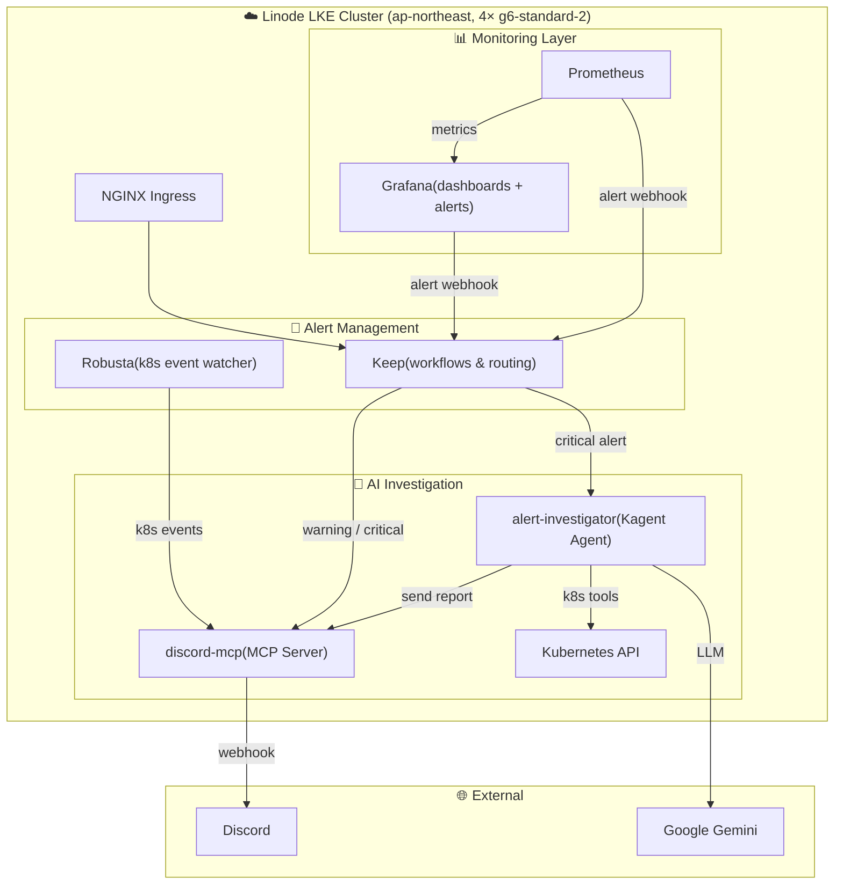
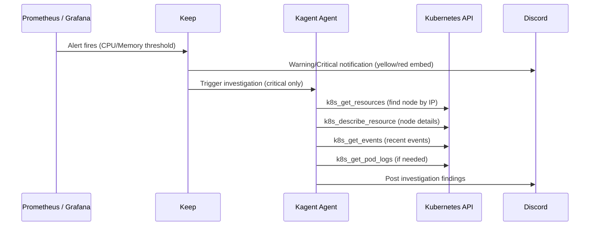

# kagent-aiops-infra-iac

AI-powered Kubernetes observability and incident response stack, fully provisioned with Terraform on Linode LKE.

When an alert fires, the pipeline automatically investigates the cluster using a Kagent AI agent powered by Gemini, then posts findings to Discord — no human needed for first-response triage.

## Architecture



### Alert Flow



## Components

| Component | Role | Namespace |
|---|---|---|
| **Prometheus** | Scrapes cluster metrics; routes alerts to Keep via webhook | `monitoring` |
| **Grafana** | Dashboards + alert rules (CPU/Memory warn/crit at 80%/90%) | `monitoring` |
| **Keep** | Alert aggregation, deduplication, and workflow engine | `keep` |
| **Robusta** | Watches Kubernetes events and streams them to Discord | `robusta` |
| **Kagent** | Kubernetes-native AI agent framework | `kagent` |
| **alert-investigator** | Declarative AI agent: receives critical alerts, calls K8s tools, posts findings to Discord | `kagent` |
| **discord-mcp** | Python MCP server that bridges kagent A2A protocol to Discord webhooks | `kagent` |
| **NGINX Ingress** | LoadBalancer ingress for Keep UI and API | `ingress-nginx` |

### Kagent Agent Tools

The `alert-investigator` agent uses a strict tool-only mode (no free-form text) and follows this investigation sequence:

1. `k8s_get_resources` — match the alert IP to a node name
2. `k8s_describe_resource` — get full node details
3. `k8s_get_events` — gather recent cluster events
4. `send_discord_message` — post structured findings to Discord

### Alert Rules

| Rule | Warning | Critical |
|---|---|---|
| Node CPU Usage | > 80% for 30s | > 90% for 30s |
| Node Memory Usage | > 80% for 30s | > 90% for 30s |

### Keep Workflows

| Workflow | Trigger | Action |
|---|---|---|
| `discord-warning` | Grafana warning alert | Discord embed (yellow) |
| `discord-critical` | Grafana critical alert | Discord embed (red) |
| `kagent-trigger` | Grafana critical alert | POST to kagent alert-investigator |

## Prerequisites

- [Terraform](https://developer.hashicorp.com/terraform/install)
- [kubectl](https://kubernetes.io/docs/tasks/tools/)
- [Task](https://taskfile.dev/installation/)
- Linode API token
- Google Gemini API key
- Discord webhook URL

## Setup

```bash
# 1. Copy and fill in secrets
cp terraform.tfvars.example terraform.tfvars

# 2. Init and apply
terraform init
terraform apply

# 3. Configure kubectl context
task kubeconfig
```

## Common Tasks

```bash
task open-grafana    # Open Grafana UI in browser
task open-keep       # Open Keep UI in browser
task open-kagent     # Port-forward Kagent UI to localhost:8080

task kagent-agents   # List all kagent agents and status
task kagent-test     # Send a test alert to alert-investigator

task stress-cpu      # Run CPU stress test to trigger alerts
task stop-stress     # Remove stress test pod
task watch-nodes     # Watch node resource usage in real-time
```

## Variables

| Variable | Description |
|---|---|
| `linode_token` | Linode API token |
| `grafana_admin_password` | Grafana admin password |
| `gemini_api_key` | Google Gemini API key (for kagent LLM) |
| `keep_secret_key` | Keep platform JWT secret |
| `discord_webhook_url` | Discord incoming webhook URL |
| `robusta_signing_key` | Robusta platform signing key |
